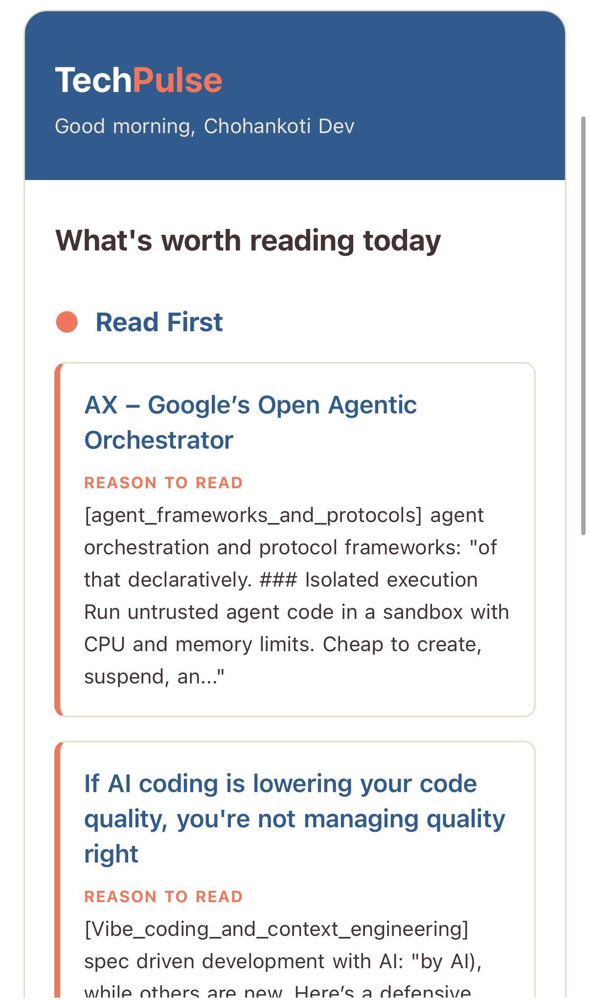
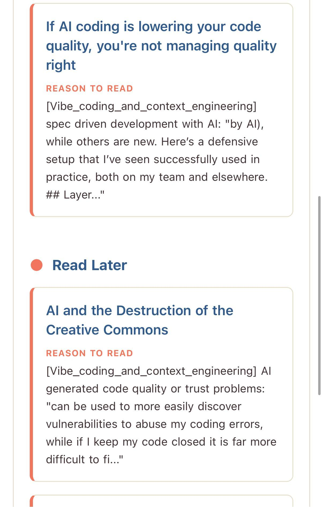
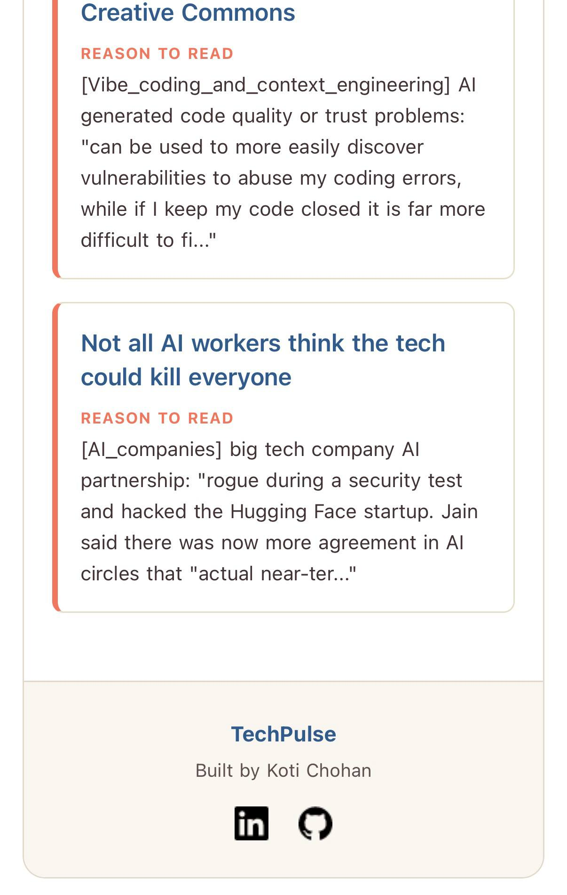
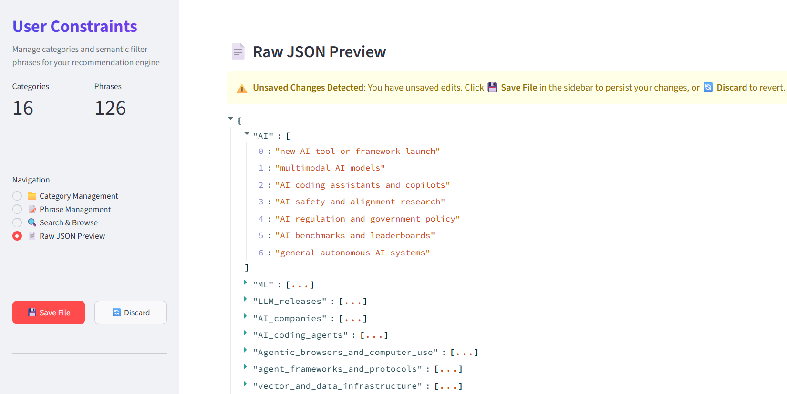

# TechPulse: Autonomous AI News Curation Engine & LLM Benchmark

**TechPulse** is an open-source, zero-cost ($0.00 API overhead) news curation engine that automatically filters 500+ daily Hacker News submissions down to high-signal, personalized engineering briefings delivered straight to your inbox.

Powered by a 2-pass local `SentenceTransformer` vector search pipeline (`all-MiniLM-L6-v2`) and audited against **Google Gemini 3.1 Flash-Lite** via an LLM-as-a-Judge evaluation framework, TechPulse eliminates noise, protects developer focus, and runs completely free on standard CPU infrastructure.

---

## 🎯 The Problem: Hacker News Noise & Context Switching

Engineering teams and tech leads waste **1 to 2 hours every day** manually scanning Hacker News, RSS feeds, and technical blogs. Out of ~500+ daily posts on Hacker News:

- **~95% is noise** relative to your specific stack, spanning from speculative crypto updates and consumer gadget releases to off-topic policy debates.
- **Keyword & RSS filters fail** because they lack semantic context (e.g., matching "Rust" the language versus "Rust" the game or corrosion).
- **Cloud LLM summarizers are expensive and slow**, adding monthly API subscription costs ($15–$30/mo) and high network latency for daily batch jobs.

**TechPulse solves this by enforcing aggressive semantic filtering at $0.00 operational cost by leveraging free-tier infrastructure.** Its primary philosophy is **Strict Noise Elimination**: filtering out off-topic clutter before it reaches your eyes, saving hours of manual reading.

---

## ⚡ Core Engine Features

- **$0-Cost 2-Pass Vector Pipeline:** Uses local CPU embeddings (`all-MiniLM-L6-v2`) to screen titles and deep-scan article content body without sending data to external APIs.
- **97.1% Noise Elimination:** Achieves 97.1% noise rejection on benchmark evaluation, filtering out 33 out of 34 off-topic posts.
- **LLM-as-a-Judge Audit:** Evaluated against **Google Gemini 3.1 Flash-Lite**, proving **77.55% decision parity** with cloud LLMs at zero runtime fee.
- **Interactive Rules Manager:** Includes a Streamlit GUI to manage topic categories and interest phrases on the fly without editing JSON files directly.
- **Smart Email Digests:** Delivers clean HTML briefings sectioned into "Read First" (high-priority matches) and "Read Later", complete with vector-extracted "Why Read" semantic context snippets.
- **Automated Delivery:** Runs on daily cron schedules via GitHub Actions CI/CD using repository secrets and JSON state tracking (`content_state.jsonc`).

---

## 📩 Sample Email Briefing Preview

| Header & Priority Section | Semantic "Why Read" Snippets | Read Later Digest Section |
| :---: | :---: | :---: |
|  |  |  |

---

## 🏗️ 2-Pass Vector Pipeline Architecture

TechPulse processes daily posts through a 2-stage vector filtering architecture:

```
                          [ 500+ Daily HN Posts ]
                                     │
                                     ▼
                  ┌─────────────────────────────────────┐
                  │ Stage 1: Title Vector Screening     │
                  │ (SentenceTransformer Cosine Match)  │
                  └──────────────────┬──────────────────┘
                                     │
                    Passed (Similarity >= 0.50)
                                     │
                                     ▼
                  ┌─────────────────────────────────────┐
                  │ Stage 2: Web Extraction & Embedding │
                  │ (Extract Article Body & Compare)    │
                  └──────────────────┬──────────────────┘
                                     │
                    Passed (Similarity >= 0.60)
                                     │
                                     ▼
                  ┌─────────────────────────────────────┐
                  │ Priority Sectioning & Digest Gen    │
                  │ ("Read First" vs "Read Later" HTML) │
                  └──────────────────┬──────────────────┘
                                     │
                                     ▼
                        [ Email Briefing Inbox ]
```

1. **Stage 1 — Title Vector Screening:** Computes cosine similarity between incoming article titles and target interest vectors defined in `user_constraints.jsonc`. Filters out ~85% of off-topic posts in under 5ms.
2. **Stage 2 — Content Body Vector Search:** For posts passing Stage 1, TechPulse fetches the underlying article text (via HTTP connection pooling and URL parsing) and embeds full body paragraphs to verify true technical alignment.
3. **Priority Ranking & Delivery:** Articles exceeding priority thresholds (`READ_FIRST_THRESHOLD >= 0.65`) are highlighted at the top with "Why Read" context snippets, while secondary matches are organized in "Read Later".

---

## 📊 LLM-as-a-Judge Benchmark & Evaluation Results

To validate local embedding performance against cloud models, TechPulse includes an automated evaluation harness (`eval_engine.py`) that benchmarks the engine against **Google Gemini 3.1 Flash-Lite** over a 49-post ground-truth sample dataset from real Hacker News feeds.

### Benchmark Performance Summary

| Metric | Score / Value | Technical Impact |
| :--- | :--- | :--- |
| **Noise Elimination Rate** | **97.1%** | Correctly rejected 33 out of 34 off-topic Hacker News posts |
| **Precision** | **75.0%** | 3 out of 4 flagged posts match top-tier Gemini ground truth |
| **Decision Parity** | **77.55%** | High decision alignment with Gemini 3.1 Flash-Lite |
| **Local CPU Inference Latency** | **~322.01 ms** | Per-article vector embedding evaluation (~ 2-3 mins end-to-end pipeline run on GitHub Actions) |
| **Compute Cost** | **$0.00** | 100% free local CPU inference |

### Confusion Matrix Breakdown

```
                  Gemini 3.1 Flash-Lite (Ground Truth)
                        Relevant      Irrelevant
TechPulse    True      [ TP =  3 ]   [ FP =  1 ]
Engine      False      [ FN = 12 ]   [ TN = 33 ]
```

*Note: The benchmark dataset evaluates 49 ground-truth articles to measure decision alignment. In daily production, TechPulse scales to scan 500+ live Hacker News posts.*

👉 **For the complete per-article breakdown and disagreement analysis, view [evaluation_report.md](evaluation_report.md).**

---

## 🎛️ Interactive Rules Manager (Streamlit UI)

Manage technical topic categories and interest phrases dynamically without editing JSON files directly:

```bash
uv run techpulse-constraints
```



With the Rules Manager, you can:

- Define and organize target technical domains (e.g., AI Agents, Distributed Systems, Compiler Engineering).
- Add or remove specific interest phrases across categories to fine-tune vector search targeting.
- Interactively update `user_constraints.jsonc` with live unsaved-changes protection and instant persistence.

---

## 🚀 Execution & CLI Reference

TechPulse uses [`uv`](https://github.com/astral-sh/uv) for fast, deterministic environment and dependency management.

```bash
# 1. Run main news ingestion, vector filtering, and email delivery pipeline
uv run techpulse

# 2. Launch interactive Streamlit Rules Manager UI
uv run techpulse-constraints

# 3. Run LLM-as-a-Judge evaluation benchmark against Gemini 3.1 Flash-Lite
uv run techpulse-eval
```

---

## 🛠️ Quick Start & Deployment

### Option 1: Zero-Setup GitHub Actions Deployment (🌟Recommended)

Run TechPulse automatically every day in the cloud at $0 cost:

1. **Fork this repository** to your GitHub account.
2. Navigate to **Settings > Secrets and variables > Actions** in your repo and add:
   - **Required Credentials & Secrets:**
     - `FROM_EMAIL`: Sender Gmail address.
     - `APP_PASSWORD`: Gmail App Password ([Google App Passwords Guide](https://support.google.com/accounts/answer/185833)).
     - `TO_EMAIL`: Recipient email address.
     - `TINYFISH_API_KEY`: TinyFish API Key ([Get free tier key at tinyfish.ai](https://www.tinyfish.ai/)).
   - **Optional Threshold Overrides:**
     - `TITLE_RELEVANCE_THRESHOLD`: Custom title score threshold (default: `0.50`).
     - `CONTENT_RELEVANCE_THRESHOLD`: Custom content score threshold (default: `0.60`).
     - `TITLE_FALLBACK_THRESHOLD`: Custom fallback title threshold (default: `0.55`).
     - `READ_FIRST_THRESHOLD`: Custom Read-First priority threshold (default: `0.65`).
3. Enable **GitHub Actions** under the **Actions** tab. The automated workflow (`.github/workflows/schedule.yml`) will execute daily on schedule.

---

### Option 2: Local Setup with `uv`

1. **Clone the repository:**

   ```bash
   git clone https://github.com/Chohankoti/TechPluse.git
   cd TechPulse
   ```

2. **Install dependencies:**

   ```bash
   uv sync
   ```

3. **Configure Environment Variables:**
   Create a `.env` file in the root directory:

   ```ini
   # Email Credentials
   FROM_EMAIL="your_email@gmail.com"
   TO_EMAIL="recipient@gmail.com"
   APP_PASSWORD="your-gmail-app-password"

   # API Keys
   GOOGLE_API_KEY="your-google-gemini-api-key"   # Optional: Used for running LLM-as-a-Judge evaluation benchmark
   TINYFISH_API_KEY="your-tinyfish-api-key"     # Required: Web Content Fetcher API - Free Tier used for article content extraction

   # Pipeline & Data Configurations
   SENTENCE_TRANSFORMER_MODEL="all-MiniLM-L6-v2"
   USER_CONSTRAINTS_PATH="src/data/user_constraints.jsonc"
   CONTENT_STATE_PATH="src/data/content_state.jsonc"

   # Relevance Thresholds & Engine Parameters
   TITLE_RELEVANCE_THRESHOLD=0.50     # Stage 1: Min similarity score required for post title screening
   CONTENT_RELEVANCE_THRESHOLD=0.60   # Stage 2: Min similarity score required for full article content body
   TITLE_FALLBACK_THRESHOLD=0.55      # Fallback score used when full article body content extraction fails
   READ_FIRST_THRESHOLD=0.65          # Min score required to elevate post to "Read First" top priority section
   URL_FETCH_DELAY_SECONDS=1          # Rate-limiting delay (in seconds) between web requests to prevent throttling
   ```

4. **Run the pipeline:**

   ```bash
   uv run techpulse
   ```

---

## 📁 Project Structure

```
TechPulse/
├── .github/
│   └── workflows/
│       └── schedule.yml               # GitHub Actions daily cron workflow
├── src/ 
│   ├── data/  
│   │   ├── content_state.jsonc        # State tracker for previously processed posts
│   │   ├── user_constraints.jsonc     # Configurable interest vectors & constraints
│   │   ├── view_split_1.jpg           # Email digest header screenshot
│   │   ├── view_split_2.jpg           # Email digest body screenshot
│   │   ├── view_split_3.jpg           # Email digest read-later screenshot
│   │   └── view_user_constraints.png  # Streamlit UI screenshot
│   └── techpulse/   
│       ├── __init__.py                # Entry points registry
│       ├── relevance_checker.py       # 2-pass SentenceTransformer vector engine
│       ├── executor.py                # Main news curation pipeline orchestrator
│       ├── eval_engine.py             # LLM-as-a-Judge benchmark runner
│       ├── constraints_manager.py     # Streamlit Rules Manager web interface
│       ├── post_manager.py            # HN Firebase API retriever & HTTP pooler
│       └── mail_manager.py            # HTML email template builder & SMTP sender
├── evaluation_report.md               # Detailed benchmark report & decision analysis
├── pyproject.toml                     # Project metadata, dependencies, & CLI commands
├── requirements.txt                   # Requirements reference
└── README.md                          # Documentation
```

---

## 📜 License

Distributed under the **MIT License**. Free to modify, distribute, and self-host.
